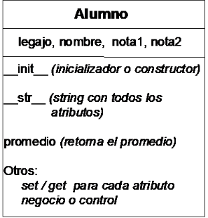

### Desarrollo de aplicaciones orientadas a objetos con python

## 1.

## 2.

## 3. Clases en python
Las clases proveen una forma de empaquetar datos (atributos o propiedades) y funcionalidad (métodos) juntos. Es un molde para crear objetos. Se puede decir que 'Un objeto es una instancia de una clase'.

Sintaxis:
```
class Alumno:
    # Definición de atributos y métodos
```

El nombre de la clase representa una entidad, los *atributos son variables* y los *métodos son las funciones*. Dentro de los que son los métodos tenemos:
- Automáticos > Inicialización y retorno de todos los atributos
- Básicos > Los clásicos get (retorno) y set (modificación)
- Negocio o control > Realizan operaciones propias para el comportamiento del objeto

    


## 6. Encapsulamiento
Es la propiedad que permite proteger los datos de las clases de manera de controlar su acceso y prohibir modificaciones no permitidas. Python no tiene un mecanismo fijo para definir el control de acceso, pero con el prefijo _ se indica que son privados.
¿Si son privados, cómo puedo utilizarlos? Mediante setters y getters...

## 7. Métodos mágicos
Son métodos con nombres especiales que se utilizar de manera automática por Python, ej: __init__, __str__ y __gt__ (greather than), ver documentación para explorar más de estos métodos. 

https://recursospython.com/guias-y-manuales/clases-metodos-magicos-y-propiedades/